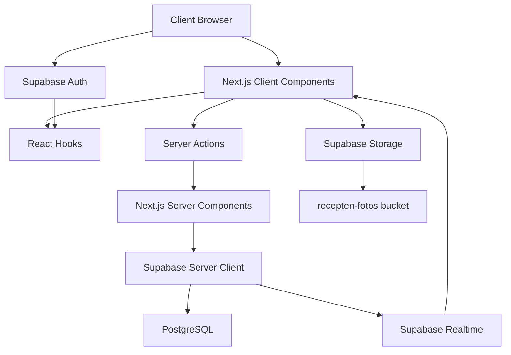
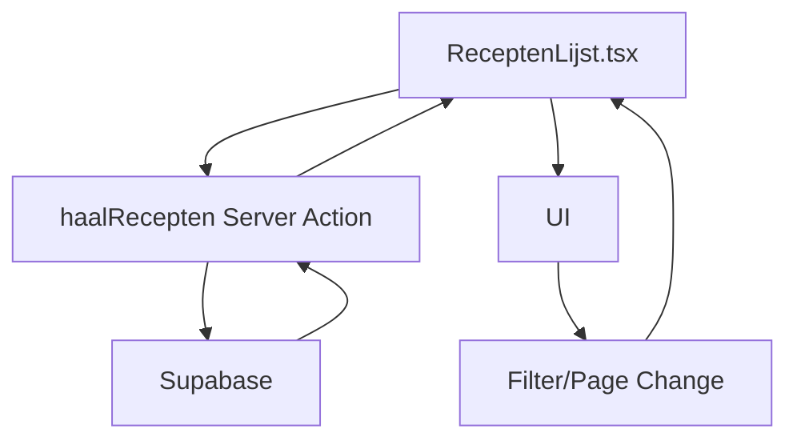
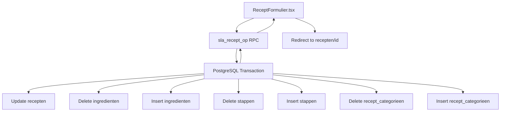
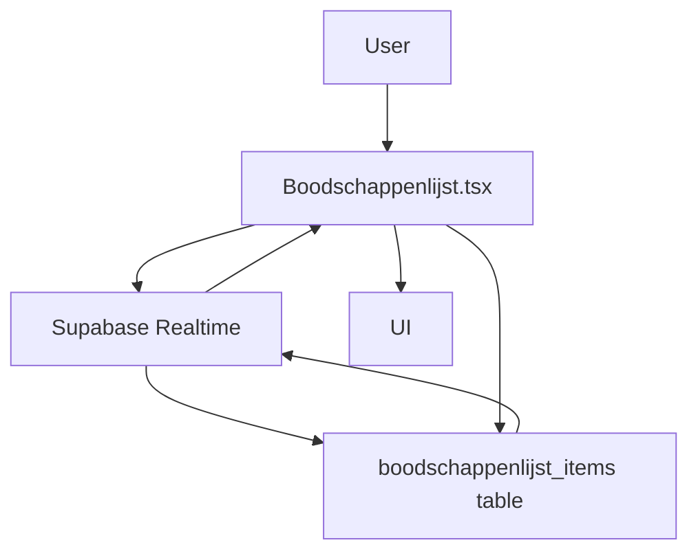
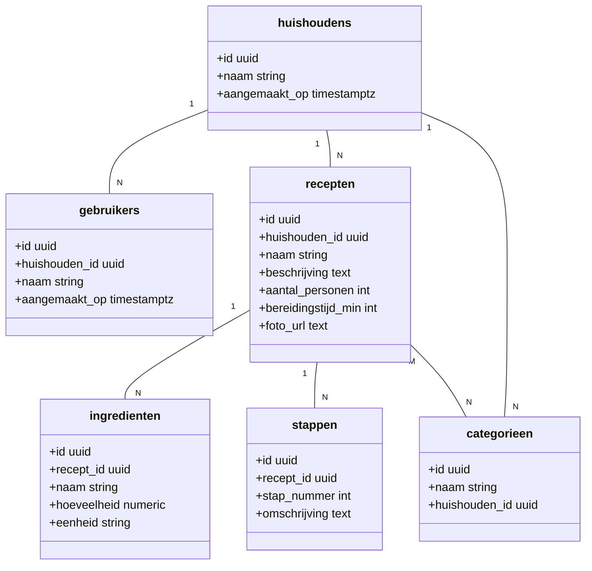

# Architectuur – ReceptenApp

> **Laatst bijgewerkt:** 2026-10-09
> **Versie:** 1.2

---

## 🏗️ Overzicht

ReceptenApp is een **full-stack webapplicatie** gebouwd met **Next.js 14** (App Router) en **Supabase** (PostgreSQL + Auth + Storage + Realtime). De applicatie volgt een **server-client architectuur** met duidelijke scheiding van verantwoordelijkheden.

---

## 📦 Technologie Stack

| Laag | Technologie | Versie | Verantwoordelijkheid |
|------|-------------|-------|---------------------|
| **Frontend** | Next.js 14 | 14.2.35 | UI, Routing, Client-side Logic |
| **Styling** | Tailwind CSS | v3 | Stijlen, Responsive Design |
| **Backend** | Supabase | - | Database, Auth, Storage, Realtime |
| **Database** | PostgreSQL | 15+ | Data opslag, Queries |
| **Taal** | TypeScript | 5.x | Typeveiligheid |
| **Testen** | Vitest | - | Unit Tests |
| **Linten** | ESLint | - | Code Kwaliteit |

---

## 🗺️ Architectuur Diagram



---

## 🔄 Data Flow

### 1. Recepten Data Flow



**Details:**
1. `ReceptenLijst.tsx` (Client Component) beheert UI state (filters, pagination)
2. Roept `haalRecepten()` Server Action aan met filters
3. Server Action voert Supabase query uit met:
   - `.eq('huishouden_id', ...)` - RLS filter
   - `.ilike('naam', '%term%')` - Naam filter
   - `.in('id', [...])` - Categoriefilter
   - `.range(from, to)` - Paginering
4. Resultaat (max. 25 recepten) wordt teruggegeven
5. Client component rendert de data

---

### 2. Recept Opslaan Flow (Atomisch)



**Details:**
- Alle operaties in **één PostgreSQL transactie** (T-02)
- Bij fout: **geen** gedeeltelijke updates
- Gebruikt `jsonb_array_elements()` voor dynamische arrays

---

### 3. Realtime Boodschappenlijst Flow



**Details:**
- Gebruikt Supabase Realtime voor live updates
- Wijzigingen zichtbaar binnen **3 seconden** voor alle gezinsleden
- Conflicten worden automatisch opgelost

---

## 🗃️ Database Schema

### Core Tabellen (Relaties)



---

## 🔐 Security Architectuur

### Authentication Flow

```mermaid
flowchart TB
    A[User] --> B[Supabase Auth]
    B --> C[Next.js Middleware]
    C --> D{Valid Token?}
    D --> E1[Yes]
    D --> E2[No]
    E1 --> E[App Pages]
    E2 --> F[Login Page]
    
    B --> G[auth.users table]
    G --> H[handle_new_user function]
    H --> I[gebruikers table]
    H --> J[huishoudens table]
    
    F --> K[Request Reset Link]
    K --> L[/auth/reset page]
    L --> M[supabase.auth.resetPasswordForEmail]
    M --> N[Send Email]
    N --> O[User clicks link]
    O --> P[/auth/reset/confirm page]
    P --> Q[supabase.auth.exchangeCodeForSession]
    Q --> R[Update Password]
    R --> E[App Pages]
```

**Details:**
- **Middleware** (`middleware.ts`) blokkeert alle `/(app)` routes zonder valid JWT
- **Row Level Security (RLS)** op alle tabellen
- **Trigger** `handle_new_user()` koppelt nieuwe gebruikers aan huishouden
- **Wachtwoord reset** (`app/(auth)/reset/*`): Gebruikers kunnen een resetlink aanvragen via `resetPasswordForEmail` en een nieuw wachtwoord instellen via `exchangeCodeForSession`
- **Bevestigingsmail** (`app/api/uitnodiging/registreer/route.ts`): Nieuwe gebruikers ontvangen een bevestigingsmail via `admin.auth.admin.generateLink` (US-U-01-3)

---

### RLS Policies

| Tabel | Policy | Conditie |
|-------|--------|----------|
| recepten | select | `huishouden_id = get_huishouden_id()` |
| recepten | insert | `huishouden_id = get_huishouden_id()` |
| recepten | update | `huishouden_id = get_huishouden_id()` |
| recepten | delete | `huishouden_id = get_huishouden_id()` |
| ingredienten | all | `exists (select 1 from recepten where recept_id = ingredienten.recept_id and huishouden_id = get_huishouden_id())` |
| boodschappenlijst_items | all | `huishouden_id = get_huishouden_id()` |

---

## 🚀 Performance Optimalisaties

### 1. Server-Side Filteren (T-01)
- **Voor:** Alle recepten geladen in browser (N=250+)
- **Na:** Alleen gefilterde recepten (max. 25 per pagina)
- **Impact:** Dataverkeer ⬇️ **~90%**

### 2. Atomische Transacties (T-02)
- **Voor:** Losse delete+insert operaties
- **Na:** Één transactie voor alle operaties
- **Impact:** Geen corrupte recepten meer

### 3. Realtime Synchronisatie
- **Technologie:** Supabase Realtime
- **Latency:** < 3 seconden
- **Impact:** Directe updates voor alle gezinsleden

### 4. Debounced Search
- **Debounce:** 300ms
- **Impact:** Minder DB calls bij typen

---

## 📡 API Endpoints

**Auth Routes (Next.js App Router):**
- `/auth/login` - Inlogpagina
- `/auth/register` - Registratie informatie (uitnodiging vereist)
- `/auth/reset` - Wachtwoord-resetlink aanvragen (US-U-02-3)
- `/auth/reset/confirm` - Nieuw wachtwoord instellen (US-U-02-3)
- `/auth/uitnodiging/[token]` - Account aanmaken via uitnodiging (US-U-01-3)

| Endpoint | Methode | Beschrijving | Auth |
|----------|---------|--------------|------|
| `/api/import-recept` | POST | Recept importeren via URL | ✅ |
| `/api/uitnodiging/registreer` | POST | Uitnodiging registreren + bevestigingsmail versturen (US-U-01-3) | ❌ (anon) |

---

## 🔧 Server Actions

| Action | Locatie | Beschrijving |
|--------|---------|--------------|
| `haalRecepten()` | `components/ReceptenLijstServer.tsx` | Gefilterde recepten ophalen |

---

## 📚 Gerelateerde Documenten

- [User Stories](../userstories.md) — Functionele eisen
- [Requirements](../requirements.md) — Technische eisen
- [Acceptatiecriteria](./ACCEPTATIECRITERIA.md) — AC tracking
- [Tech Debt](./TECH-DEBT.md) — Technische verbeterpunten
