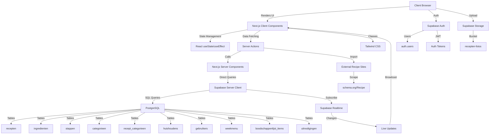
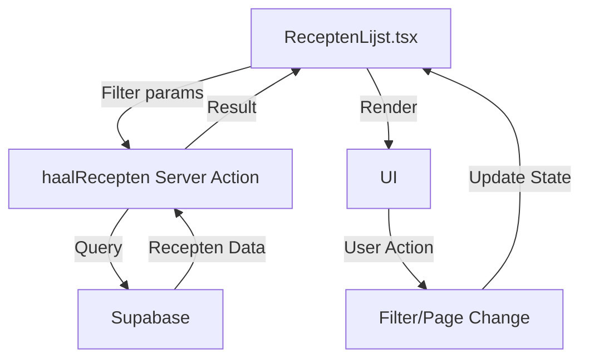
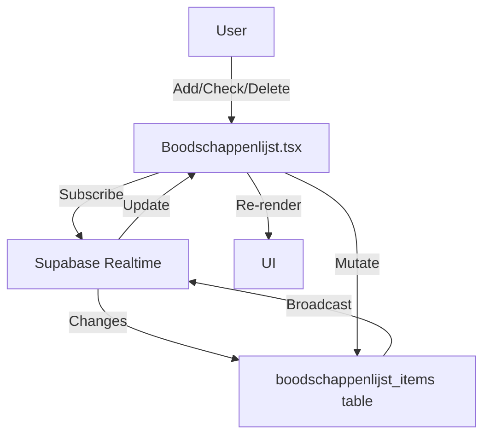

# Architectuur – ReceptenApp

> **Laatst bijgewerkt:** 2026-10-09
> **Versie:** 1.0

---

## 🏗️ Overzicht

ReceptenApp is een **full-stack webapplicatie** gebouwd met **Next.js 14** (App Router) en **Supabase** (PostgreSQL + Auth + Storage + Realtime). De applicatie volgt een **server-client architectuur** met duidelijke scheiding van verantwoordelijkheden.

---

## 📦 Technologie Stack

| Laag | Technologie | Versie | Verantwoordelijkheid |
|------|-------------|-------|---------------------|
| **Frontend** | Next.js 14 | 14.2.35 | UI, Routing, Client-side Logic |
| **Styling** | Tailwind CSS | v3 | Stijlen, Responsive Design |
| **Backend** | Supabase | - | Database, Auth, Storage, Realtime |
| **Database** | PostgreSQL | 15+ | Data opslag, Queries |
| **Taal** | TypeScript | 5.x | Typeveiligheid |
| **Testen** | Vitest | - | Unit Tests |
| **Linten** | ESLint | - | Code Kwaliteit |

---

## 🗺️ Architectuur Diagram



---

## 📁 Project Structuur

```
recepten-app/
├── app/                          # Next.js App Router
│   ├── (auth)/                   # Auth pages (login, register, uitnodiging)
│   │   ├── login/
│   │   │   └── page.tsx          # Inlogpagina
│   │   ├── register/
│   │   │   └── page.tsx          # Registratiepagina
│   │   └── uitnodiging/
│   │       └── [token]/
│   │           └── page.tsx      # Uitnodigingspagina
│   │
│   └── (app)/                    # Auth-protected pages
│       ├── layout.tsx            # App layout (met Nav)
│       ├── recepten/
│       │   ├── page.tsx          # Recepten overzicht
│       │   ├── [id]/
│       │   │   └── page.tsx      # Recept detail
│       │   ├── [id]/
│       │   │   └── bewerken/
│       │   │       └── page.tsx  # Recept bewerken
│       │   ├── nieuw/
│       │   │   └── page.tsx      # Nieuw recept
│       │   ├── importeren/
│       │   │   └── page.tsx      # Recept importeren
│       │   └── categorieen/
│       │       └── page.tsx      # Categorieën beheren
│       ├── weekmenu/
│       │   └── page.tsx          # Weekmenu overzicht
│       └── boodschappenlijst/
│           └── page.tsx          # Boodschappenlijst
│
├── app/
│   ├── api/                      # API Routes
│   │   ├── import-recept/
│   │   │   └── route.ts          # URL import endpoint
│   │   └── uitnodiging/
│   │       └── registreer/
│   │           └── route.ts      # Uitnodiging registratie
│   └── page.tsx                  # Root redirect
│
├── components/                   # React Components
│   ├── Nav.tsx                  # Navigatiebalk
│   ├── ReceptenLijst.tsx         # Receptenlijst (Client)
│   ├── ReceptenLijstServer.tsx  # Server Action voor recepten
│   ├── ReceptFormulier.tsx      # Recept formulier
│   ├── ReceptWeekMenuKiezer.tsx # Weekmenu kiezer
│   ├── WeekMenuOverzicht.tsx    # Weekmenu overzicht
│   ├── Boodschappenlijst.tsx     # Boodschappenlijst
│   ├── CategorieenBeheer.tsx    # Categorieën beheer
│   ├── UitnodigingenBeheer.tsx   # Uitnodigingen beheer
│   ├── UitnodigingRegistreren.tsx # Uitnodiging registreren
│   ├── URLImportFormulier.tsx   # URL import formulier
│   ├── FotoLightbox.tsx         # Foto lightbox
│   └── VerwijderKnop.tsx        # Verwijder bevestiging
│
├── lib/                          # Utilities & Types
│   ├── supabase/
│   │   ├── client.ts            # Supabase Client (browser)
│   │   └── server.ts            # Supabase Client (server)
│   ├── types.ts                 # TypeScript types
│   ├── database.types.ts        # Supabase generated types
│   ├── paginering.ts            # Paginering utilities
│   ├── duplicaten.ts            # Ingrediënten samenvoegen
│   ├── week.ts                  # Week utilities
│   └── recept-import.ts         # Recept import utilities
│
├── middleware.ts                 # Auth middleware
├── schema.sql                    # Database schema
├── migration_*.sql               # Database migrations
└── docs/                         # Documentatie
    ├── ACCEPTATIECRITERIA.md    # AC dashboard
    ├── ARCHITECTURE.md           # Architectuur (dit bestand)
    └── TECH-DEBT.md              # Tech debt overzicht
```

---

## 🔄 Data Flow

### 1. Recepten Data Flow



**Details:**
1. `ReceptenLijst.tsx` (Client Component) beheert UI state (filters, pagination)
2. Roept `haalRecepten()` Server Action aan met filters
3. Server Action voert Supabase query uit met:
   - `.eq('huishouden_id', ...)` - RLS filter
   - `.ilike('naam', '%term%')` - Naam filter
   - `.in('id', [...])` - Categoriefilter
   - `.range(from, to)` - Paginering
4. Resultaat (max. 25 recepten) wordt teruggegeven
5. Client component rendert de data

---

### 2. Recept Opslaan Flow (Atomisch)

```mermaid
flowchart TD
    A[ReceptFormulier.tsx] -->|Submit| B[sla_recept_op RPC]
    B -->|Transaction| C[PostgreSQL]
    C -->|Update recepten| D[recepten table]
    C -->|Delete ingredienten| E[ingredienten table]
    C -->|Insert ingredienten| E
    C -->|Delete stappen| F[stappen table]
    C -->|Insert stappen| F
    C -->|Delete recept_categorieen| G[recept_categorieen table]
    C -->|Insert recept_categorieen| G
    C -->|Return recept_id| B
    B -->|recept_id| A
    A -->|Redirect| H[/recepten/{id}]
```

**Details:**
- Alle operaties in **één PostgreSQL transactie** (T-02)
- Bij fout: **geen** gedeeltelijke updates
- Gebruikt `jsonb_array_elements()` voor dynamische arrays

---

### 3. Realtime Boodschappenlijst Flow



**Details:**
- Gebruikt Supabase Realtime voor live updates
- Wijzigingen zichtbaar binnen **3 seconden** voor alle gezinsleden
- Conflicten worden automatisch opgelost

---

## 🗃️ Database Schema

### Core Tabellen

```mermaid
erDiagram
    huishoudens ||--o{ gebruikers : "1:N"
    huishoudens ||--o{ recepten : "1:N"
    huishoudens ||--o{ categorieen : "1:N"
    huishoudens ||--o{ weekmenu : "1:N"
    huishoudens ||--o{ boodschappenlijst_items : "1:N"
    huishoudens ||--o{ uitnodigingen : "1:N"
    
    recepten ||--o{ ingredienten : "1:N"
    recepten ||--o{ stappen : "1:N"
    recepten ||--o{ weekmenu : "1:1"
    
    recepten }|--|| categorieen : "M:N"
    recepten : string id PK
    recepten : string huishouden_id FK
    recepten : string naam
    recepten : text beschrijving
    recepten : int aantal_personen
    recepten : int bereidingstijd_min
    recepten : text foto_url
    
    ingredienten : string id PK
    ingredienten : string recept_id FK
    ingredienten : string naam
    ingredienten : numeric hoeveelheid
    ingredienten : string eenheid
    
    stappen : string id PK
    stappen : string recept_id FK
    stappen : int stap_nummer
    stappen : text omschrijving
    
    categorieen : string id PK
    categorieen : string naam
    categorieen : string huishouden_id FK
    
    recept_categorieen : string recept_id FK
    recept_categorieen : string categorie_id FK
```

---

## 🔐 Security Architectuur

### Authentication Flow

```mermaid
flowchart TD
    A[User] -->|Login| B[Supabase Auth]
    B -->|JWT Token| C[Next.js Middleware]
    C -->|Check| D{Valid?}
    D -->|Yes| E[App Pages]
    D -->|No| F[Login Page]
    
    B -->|User Data| G[auth.users table]
    G -->|Trigger| H[handle_new_user()]
    H -->|Create| I[gebruikers table]
    H -->|Create| J[huishoudens table]
```

**Details:**
- **Middleware** (`middleware.ts`) blokkeert alle `/(app)` routes zonder valid JWT
- **Row Level Security (RLS)** op alle tabellen
- **Trigger** `handle_new_user()` koppelt nieuwe gebruikers aan huishouden

---

### RLS Policies

| Tabel | Policy | Conditie |
|-------|--------|----------|
| recepten | select | `huishouden_id = get_huishouden_id()` |
| recepten | insert | `huishouden_id = get_huishouden_id()` |
| recepten | update | `huishouden_id = get_huishouden_id()` |
| recepten | delete | `huishouden_id = get_huishouden_id()` |
| ingredienten | all | `exists (select 1 from recepten where recept_id = ingredienten.recept_id and huishouden_id = get_huishouden_id())` |
| boodschappenlijst_items | all | `huishouden_id = get_huishouden_id()` |

---

## 🚀 Performance Optimalisaties

### 1. Server-Side Filteren (T-01)
- **Voor:** Alle recepten geladen in browser (N=250+)
- **Na:** Alleen gefilterde recepten (max. 25 per pagina)
- **Impact:** Dataverkeer ⬇️ **~90%**

### 2. Atomische Transacties (T-02)
- **Voor:** Losse delete+insert operaties
- **Na:** Één transactie voor alle operaties
- **Impact:** Geen corrupte recepten meer

### 3. Realtime Synchronisatie
- **Technologie:** Supabase Realtime
- **Latency:** < 3 seconden
- **Impact:** Directe updates voor alle gezinsleden

### 4. Debounced Search
- **Debounce:** 300ms
- **Impact:** Minder DB calls bij typen

---

## 📡 API Endpoints

| Endpoint | Methode | Beschrijving | Auth |
|----------|---------|--------------|------|
| `/api/import-recept` | POST | Recept importeren via URL | ✅ |
| `/api/uitnodiging/registreer` | POST | Uitnodiging registreren | ❌ (anon) |

---

## 🔧 Server Actions

| Action | Locatie | Beschrijving |
|--------|---------|--------------|
| `haalRecepten()` | `components/ReceptenLijstServer.tsx` | Gefilterde recepten ophalen |

---

## 📚 Gerelateerde Documenten

- [User Stories](../userstories.md) — Functionele eisen
- [Requirements](../requirements.md) — Technische eisen
- [Acceptatiecriteria](./ACCEPTATIECRITERIA.md) — AC tracking
- [Tech Debt](./TECH-DEBT.md) — Technische verbeterpunten
